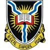

# <== This is Munawar! 
I'm into all things software. Currently focused on managing data, storing it and finally reporting on it to help making the right business decisions.
Also working on Cloud Solutions for Data Warehouses.

## Experience
| | | |
|:--:|:--:|:--:|
| </img> | [Berkley Technology Services](https://www.berkley-bts.com/) | Manager of Investment Applications |
| </img> | ZehnSoft Technologies | Principal Consultant |
| </img> | [Pershing](https://www.pershing.com/) |  Vice President |
| </img> | [AIG Investments](https://www.aig.com/) | Technology Specialist-System Design and Development  |

## Education
| | | |
|:--:|:--:|:--:|
| </img> | [University of Bradford](https://www.bradford.ac.uk/) | M.Sc. Real-Time Electronic Systems |
| </img> | [Univesity of Ibadan](http://www.ui.edu.ng/) | B.Sc. Electrical Engineering |

